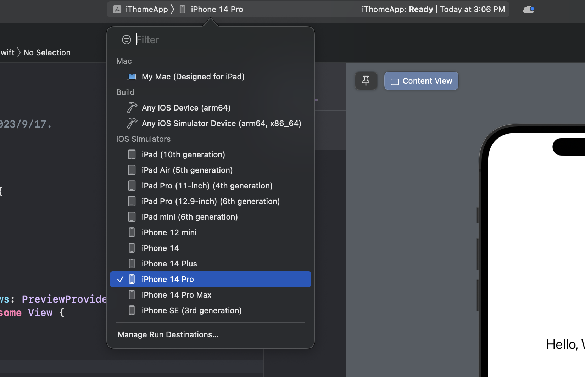
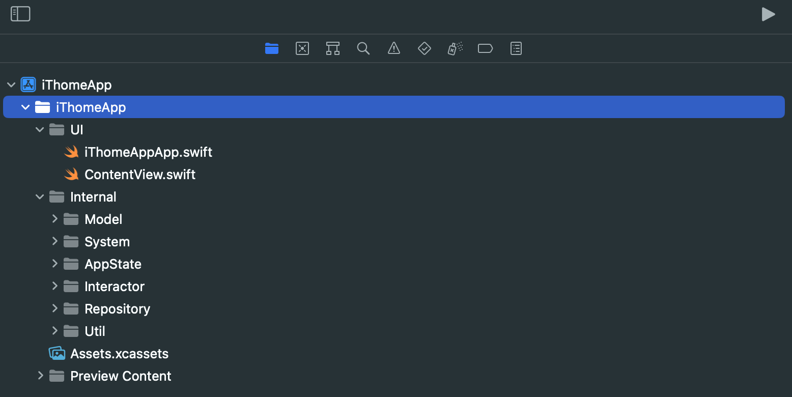
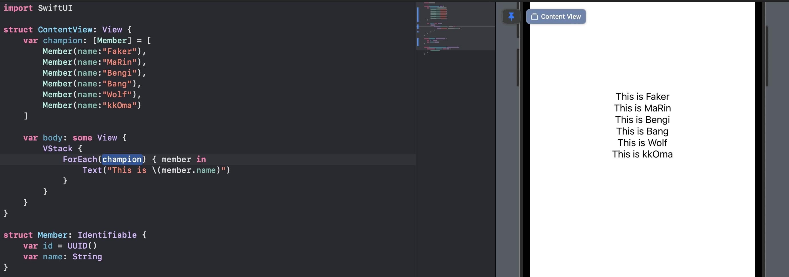
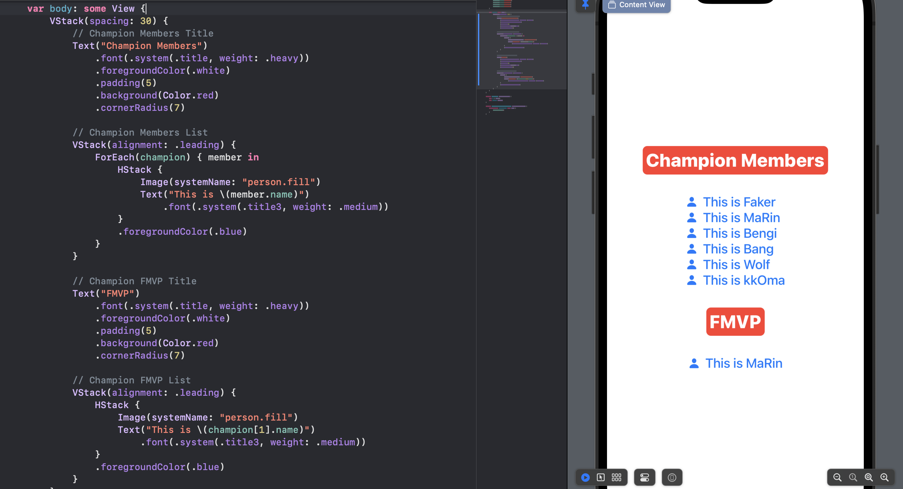
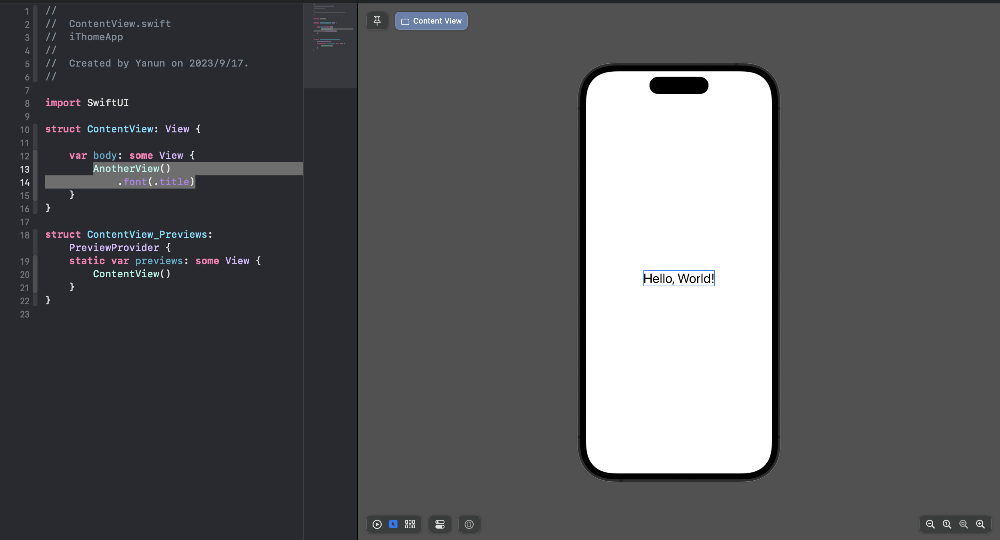
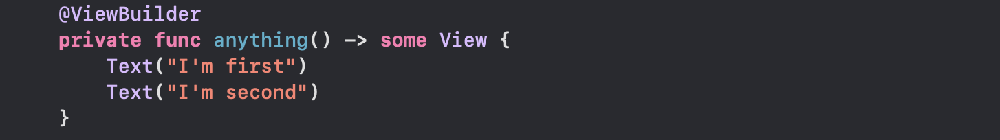
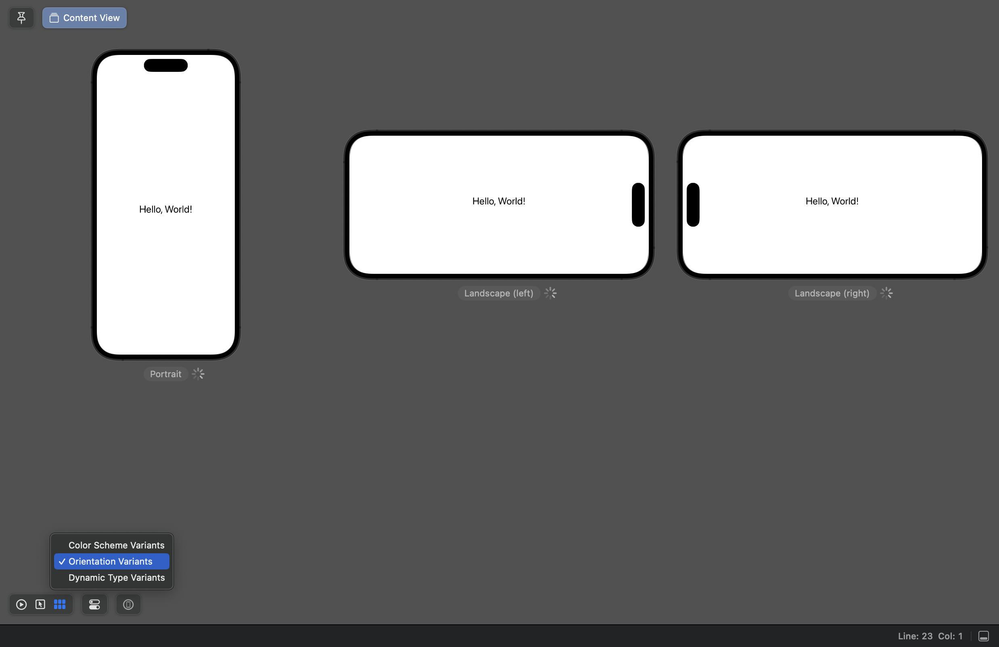
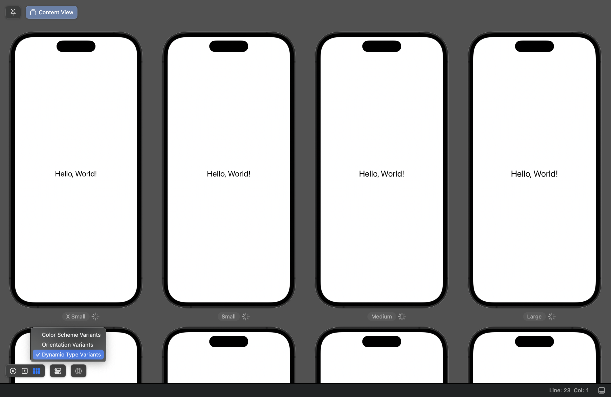

不管是文字、圖片，還有未來其他的元件都會用到顏色，今天就來看看 `SwiftUI` 的顏色。

# Color
---
`Color` 可以當作一個元件，也可以當作一個參數。

`SwiftUI` 的系統已經有幫你定義了一些比較常用的 `Color` 
```swift
Color.red
```


`Color` 也是一個 `View`，所以 `View` 可以用的基本修飾器他也可以用，例如 `frame`

```swift
Color.red
    .frame(width: 150, height: 200)
    .cornerRadius(15)
```



> `.cornerRadius` 是圓角矩形修飾器，也在 `Image` 上試試看？

## 自訂 Color

若是你要自訂的話，和圖片很像，需要到 `Assets.xcassets` 定義顏色：

> 先在 Assets.xcassets 內新建 Color Set



> 取好名稱（我這邊取名 `T1`），然後開起最右邊的 `Inspectors` 面板



> 右邊面板的 `Appearances` 欄位可以定義你的顏色是否要根據深色模式來額外定義：



> 點選中間顏色區塊，就可以在右邊面板選擇你要的顏色



> 之後就可以使用這個 `Color`

```swift
Color("T1")
```


# ForegroundColor
---
上一章我們學到 `Text` 和 `Image`，這邊我們可以用 `.foregroundColor` 這個修飾器來改變他的前景色。

```swift
Text("Faker! What was that!")
    .foregroundColor(.blue)
```



```swift
Image(systemName: "square.and.arrow.up")
    .foregroundColor(.blue)
```



# 總結
---
`Color` 可以單獨使用當作元件。

使用 `.foregroundColor` 修飾器可以改變元件的前景色。
